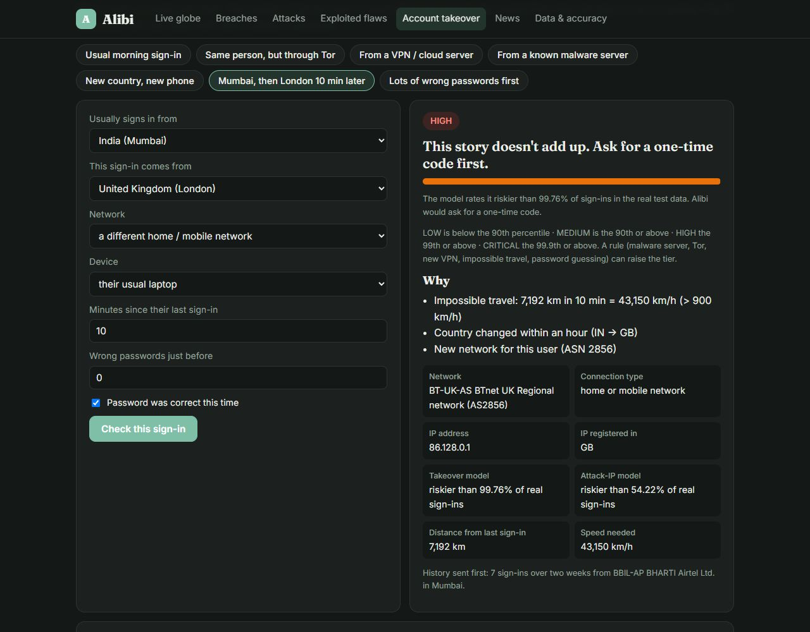
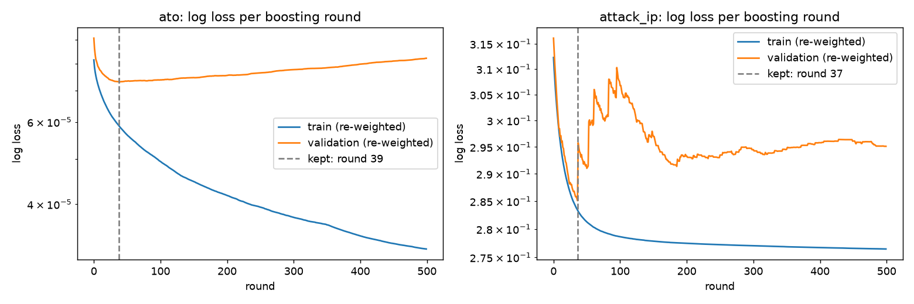
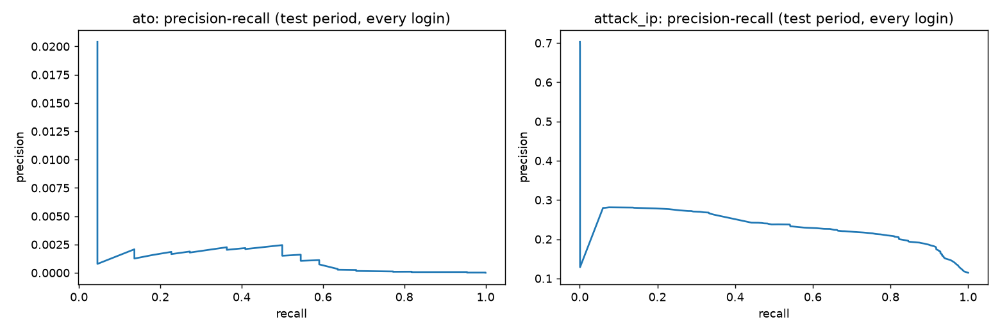

# Alibi: who's breaking in, how, and from where


Alibi gathers the world's public security data in one place, on a live 3D globe:
- which companies lost their customers' data, and how it got out;
- the servers attackers are using right now, and the networks run by criminals;
- the businesses ransomware gangs claimed this week;
- the software flaws being exploited today.

On top of that, a model trained on **31.3 million real-world logins** decides whether a sign-in is the real
account owner, or someone on Tor, a VPN, a malware server or an impossible journey.

**Live demo:** https://impossible-travel-auth-anomaly-engi.vercel.app
**API docs:** https://impossible-travel-auth-anomaly-engi.vercel.app/docs

**In one sentence, for anyone:** Alibi shows who is getting hacked and how, and checks every sign-in for an
alibi: does this look like the real person, from their usual place, network and device?

## What it shows

All figures below come from the data snapshot of **4 October 2026**. A GitHub Action ([refresh-intel.yml](.github/workflows/refresh-intel.yml)) re-downloads every source and rebuilds the data every day, so the app always shows the latest numbers.

| Module | What you see | Headline numbers |
|---|---|---|
| **Live globe** | Real Earth (NASA Blue Marble) with every country and all 4,596 states and provinces outlined, each state coloured blue (low) to red (high). Malware and DNS servers are counted per state from their real cities (IP geolocation); data known only per country colours all its states. Hover any state for its numbers; click for top states and cities. 733 undersea cables show how countries are wired together. Chain 2 or 3 countries into a sign-in journey and the model scores each hop. | 179 countries with censorship tests, 1,927 cable landing stations |
| **Breaches** | Every breach published by Have I Been Pwned, the biggest company breaches, and **how each one happened** (read from HIBP's own write-up). | 1,020 breaches, **16.29 billion** accounts; 102 breaches and 478.7 million accounts in the last 12 months |
| **Attacks** | Live malware and botnet servers, the networks hosting them, criminal networks, and this week's ransomware victims by industry, country and gang. | **8,420** malware / botnet servers; 11,005 threat indicators in 48 hours; 430 criminal networks; 100 ransomware victims (29 Sep to 3 Oct 2026) |
| **Exploited flaws** | CISA's list of vulnerabilities confirmed as exploited in real attacks. | 1,733 flaws; 39 added in the last 30 days; 361 used by ransomware |
| **Account takeover** | Check a sign-in story with real IPs from each country's networks: usual, Tor, VPN, malware server, abroad, impossible travel, password guessing. | **14 of 22** real takeovers caught while challenging 0.77% of sign-ins |
| **News** | Live security headlines and videos from public feeds. | refreshed every 30 minutes |

### Findings worth knowing

- **Most malware isn't on rented servers.** Only 11.3% of the 8,420 malware servers sit on hosting or VPN networks.
  That's about the same as those networks' 10.9% share of all internet addresses. Half (4,231) are home routers,
  cameras and other gadgets hijacked by the Mozi and Mirai botnets. The biggest single source is China Unicom's
  home network (3,430). Blocking data centers alone misses most attacks.
- **How company data gets out** (company breaches only, from HIBP write-ups):
  - 766: hacked, method not disclosed
  - 72: ransomware or extortion
  - 45: left open online (a database with no password)
  - 34: a software flaw exploited
  - 16: through a supplier
  - 15: scraped
  - 15: phishing

  The two largest company breaches were **both databases left open online**: Verifications.io (763 million
  accounts) and a People Data Labs customer (622 million).
- **Hacker lists dwarf single breaches.** 25 credential-stuffing and info-stealer lists hold 5.15 billion
  accounts, close to a third of everything on record.
- **Who gets patched first.** In the last 12 months, Microsoft had the most actively exploited flaws (49), then
  Cisco (19), Fortinet (11) and Apple (11).
- **Ransomware hits factories and hospitals.** This week's 100 victims: manufacturing 19, healthcare 16. By
  country: 40 in the US, 10 in Germany.
- **Censorship is widespread.** Websites were confirmed blocked in 68 countries in the last 30 days, across
  50.4 million OONI tests.

## How a sign-in is checked

Two layers decide the verdict.

**1. The model.** Two gradient-boosting models score 19 behaviour features per login:
- new country, network, device or browser for this user;
- failed attempts;
- the time since the last sign-in;
- the IP's recent activity across all users.

Each score becomes a percentile of real validation logins. LOW is below 90, MEDIUM is 90 or more, HIGH is 99 or
more, and CRITICAL is 99.9 or more.

**2. Network and rule checks**, using the public data above:

| Signal | Source | Effect |
|---|---|---|
| IP reported for malware or botnet control | abuse.ch Feodo Tracker, ThreatFox, URLhaus | CRITICAL: block and alert the owner |
| IP in a network run by criminals | Spamhaus DROP / ASN-DROP | at least HIGH |
| Tor exit node | Tor Project exit list | at least HIGH |
| Hosting / VPN network the account has never used | iptoasn + 195 known hosting and VPN providers | at least HIGH (MEDIUM if it's their usual VPN) |
| 5+ wrong passwords in the last 10 attempts | login history | at least HIGH |
| Faster than 900 km/h between sign-ins (over 100 km) | coordinates | at least HIGH |
| IP's registered country differs from the claimed one | iptoasn | explained in the reasons |

| Tier | What Alibi does |
|---|---|
| LOW | let them in |
| MEDIUM | let them in and log it for review |
| HIGH | ask for a one-time code |
| CRITICAL | block and alert the owner |

Every verdict comes with plain-English reasons, such as "Impossible travel: 7,471 km in 45 min = 9,962 km/h", and
with the network that owns the IP.



*The "Mumbai, then London 10 min later" story, live from the app (open it directly at `/#check/travel`).*

## Account-takeover model results

Trained and tested on the RBA login dataset: 31,269,264 logins from 4,304,857 users. The test periods are months
the model never saw.

### Account takeover: test period 2020-10-01 → 2020-11-30

5,403,650 logins, 22 of them confirmed account takeovers.

| Method | Takeovers caught | Logins challenged | ROC-AUC |
|---|---|---|---|
| **Model, 1% alert budget** | **14 of 22 (63.64%)** | 0.77% (76.5 per 10,000) | **0.978** |
| Model, 0.1% alert budget | 8 of 22 (36.36%) | 0.07% (6.8 per 10,000) | 0.978 |
| Rule: new country *or* new network for the user | 15 of 22 (68.18%) | 3.52% (351.6 per 10,000) | 0.823 |
| Rule: new device *and* new country | 4 of 22 (18.18%) | 0.05% (5.3 per 10,000) | 0.591 |
| Rule: country changed within 1 hour | 1 of 22 (4.55%) | 34.53% (3,452.7 per 10,000) | 0.350 |

**In business terms:** sending 0.77% of logins to a one-time code stops 14 of the 22 takeovers. The best simple
rule needs 4.6× as many challenges to catch one more. With only 22 takeovers in the window, the 95% confidence
interval for the 63.64% recall is 42.95% to 80.27%.

| Metric (1% budget) | Value |
|---|---|
| ROC-AUC | 0.978 |
| PR-AUC | 0.0038 (933× the 0.0004% base rate) |
| Precision | 0.03% (14 true alerts among 41,321) |
| Recall | 63.64% |
| Accuracy | 99.24% |
| Log loss | 0.00004 |
| Brier score | 0.000004 |
| Confusion matrix | 5,362,321 TN · 41,307 FP · 8 FN · 14 TP |

Takeovers are so rare that precision is tiny for any method. That's why Alibi asks for a code instead of
blocking.

### Attack-IP logins: test period 2021-01-01 → 2021-02-28

5,279,379 logins; 604,413 (11.45%) came from IPs on a known-attacker list.

| Method | ROC-AUC | PR-AUC | Precision | Recall | Logins flagged |
|---|---|---|---|---|---|
| **Model** | **0.7487** | **0.2358** | 28.76% | 3.84% | 1.53% |
| Rule: new country or new network | 0.4925 | n/a | 6.36% | 1.65% | 2.98% |
| Rule: country changed within 1 hour | 0.4902 | n/a | 10.88% | 33.48% | 35.22% |

The model ranks better than chance but catches only 3.84% at that budget, because behaviour only partly reveals a
blocklisted IP. That's why the live network checks above sit on top of it.




**Training details** (`src/ittravel/rba/`):
- **Features:** 19 per login, built in DuckDB with window functions over all 31M rows, using earlier activity
  only.
- **Splits:** chronological. The takeover model uses train Feb–Jul 2020, validation Aug–Sep and test Oct–Nov. The
  attack-IP model uses 70/15/15 by time.
- **Sampling:** every positive plus 3,000,000 random negatives, re-weighted to the true class balance.
- **Model selection:** validation picks the boosting round (39 and 37) and the alert threshold.
- **Run time:** 36 minutes on a laptop.

**About the RBA data:** its authors synthesized each value from 33M+ real logins at a Norwegian single-sign-on
service, keeping the real per-user statistics. Cities in it are random, so impossible travel isn't evaluated on
it. Country hops are unusually common, which is why the "country changed within 1 hour" rule scores badly.

## Data sources and licenses

| Data | Source | License / terms | Used for |
|---|---|---|---|
| Data breaches | [Have I Been Pwned](https://haveibeenpwned.com) | CC BY 4.0 (attribution and link given in the app) | breach list, how they happened |
| Exploited flaws | [CISA KEV catalog](https://www.cisa.gov/known-exploited-vulnerabilities-catalog) (version 2026.10.02) | US government public data | flaws tab |
| Malware and botnet servers | [abuse.ch](https://abuse.ch) Feodo Tracker, ThreatFox, URLhaus | CC0 | attacks tab, sign-in check |
| Criminal networks | [Spamhaus DROP / ASN-DROP](https://www.spamhaus.org/blocklists/do-not-route-or-peer/) | free to use per Spamhaus DROP terms | attacks tab, sign-in check |
| Ransomware victims | [ransomware.live](https://www.ransomware.live) | no license published; **only aggregate counts** shown, no names, links or files | attacks tab, globe |
| IP → network owner | [iptoasn.com](https://iptoasn.com) | PDDL (public domain) | every IP lookup, hosting share |
| Censorship tests | [OONI](https://explorer.ooni.org) | CC BY-NC-SA 4.0 | globe |
| Public DNS servers | [public-dns.info](https://public-dns.info) | public list, counts only | globe |
| Undersea cables | [TeleGeography Submarine Cable Map](https://www.submarinecablemap.com) | CC BY-NC-SA 3.0, as TeleGeography published its open data (not re-confirmed on their site, Oct 2026) | globe connections |
| City-level IP locations | IP Geolocation by [DB-IP](https://db-ip.com) (IP to City Lite, Oct 2026) | CC BY 4.0 | heatmap hotspots, per-state counts |
| States and provinces | [Natural Earth](https://www.naturalearthdata.com) admin-1 | public domain | globe borders, click lookup |
| Country shapes | Natural Earth via [world-atlas](https://github.com/topojson/world-atlas) | public domain | globe |
| Earth imagery | NASA Blue Marble via [three-globe](https://github.com/vasturiano/three-globe) | public domain (NASA) | globe |
| Tor exits | [Tor Project](https://check.torproject.org/torbulkexitlist) | public list | sign-in check, fetched live (torproject.org was unreachable from the build network) |
| Login data | [RBA dataset](https://zenodo.org/records/6782156), Wiefling et al. 2022 | CC BY 4.0 | training and testing the models |
| News | The Hacker News, BleepingComputer, Krebs on Security, CISA advisories (RSS) | headlines and links only | news tab |
| Videos | John Hammond, NetworkChuck, Marcus Hutchins, Hak5 (YouTube feeds) | titles and links only | news tab |
| Street map | © OpenStreetMap contributors | ODbL | sign-in map |

OONI and TeleGeography data are non-commercial. Alibi is a non-commercial portfolio project.

## API

| Endpoint | Purpose |
|---|---|
| `POST /v1/demo/check` | score a whole sign-in story (usual history, then the test sign-in) in one call, no key |
| `POST /v1/auth/evaluate` | score one login and update that user's history (needs `X-API-Key`) |
| `GET /v1/intel/overview` | headline numbers |
| `GET /v1/intel/breaches` (`?full=true`) | breach summary, or every breach with how it happened |
| `GET /v1/intel/threats` | malware servers, criminal networks, ransomware counts |
| `GET /v1/intel/flaws` | exploited-flaw summary |
| `GET /v1/intel/countries` | every country's numbers for the globe |
| `GET /v1/intel/ip/{ip}` | who owns an IP, and whether it's Tor, hosting / VPN, malware or criminal |
| `GET /v1/intel/news` | live headlines and videos |
| `GET /v1/model` | test metrics of the deployed models |

```bash
curl https://impossible-travel-auth-anomaly-engi.vercel.app/v1/intel/ip/8.8.8.8
```

- The dashboard and `/v1/demo/check` are keyless and rate-limited per IP (20 demo checks a minute).
- `/v1/auth/evaluate` needs a key set server-side in `ALIBI_API_KEY`; without it that endpoint is off.
- History lives in memory, so the hosted demo is a sandbox.

## Run it

```bash
pip install -r requirements-dev.txt
PYTHONPATH=src uvicorn ittravel.api.app:app --reload --port 8000     # app at http://localhost:8000
```

Refresh the intel snapshot (about 150 MB of downloads; `pip install pycountry shapely` for the build):

```bash
bash scripts/fetch_intel.sh
PYTHONPATH=src python -m ittravel.intel.snapshot --raw data/intel
```

Retrain the models (downloads 1.1 GB; needs about 3 GB of disk for DuckDB):

```bash
curl -L -o data/rba-dataset.zip "https://zenodo.org/records/6782156/files/rba-dataset.zip?download=1"
PYTHONPATH=src python -m ittravel.rba.load --zip data/rba-dataset.zip --db data/rba.duckdb
PYTHONPATH=src python -m ittravel.rba.train --db data/rba.duckdb
```

## Tests

`pytest`: 37 tests. CI runs ruff and pytest on Python 3.11 to 3.13. They check:
- **Training:** the DuckDB feature SQL against hand-checked rows (no look-ahead), and that the live engine's
  features match the training columns.
- **IP lookups:** Google, DigitalOcean, private addresses, and reported malware servers.
- **Data:** that sample IPs come from the right country, the breach-method classifier, and that the intel
  summaries add up.
- **Feeds:** RSS and Atom parsing.
- **API and verdicts:** every intel endpoint, and the demo verdicts (malware server → CRITICAL, new VPN → HIGH,
  impossible travel → HIGH).

## License

MIT for the code. Data stays under each source's license, listed above.
