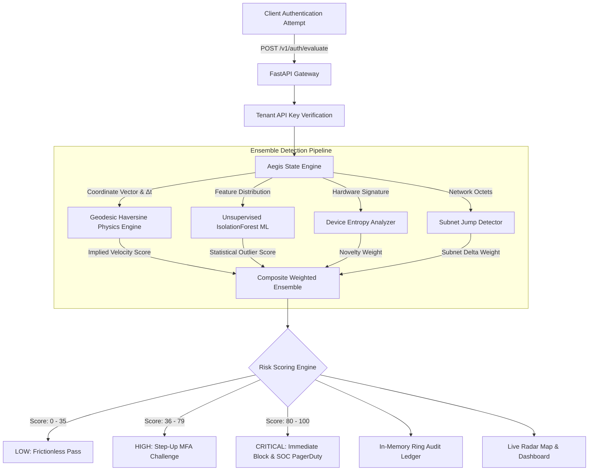

<div align="center">

# 🛡️ Aegis ITDR

### Enterprise Identity Threat Detection & Geotime Anomaly Engine
**Next-generation account takeover prevention fusing unsupervised machine learning with geodesic velocity physics.**

[](https://impossible-travel-auth-anomaly-engi.vercel.app/)
[](https://impossible-travel-auth-anomaly-engi.vercel.app/docs)
[](https://github.com/UtkarshOver9000/Aegis-Auth-Anomaly-Engine)
[](LICENSE)

<br/>

[**Explore Live Dashboard**](https://impossible-travel-auth-anomaly-engi.vercel.app/) • [**Interactive Sandbox**](https://impossible-travel-auth-anomaly-engi.vercel.app/#sandbox) • [**API Reference**](#-api-reference) • [**Architecture**](#-architecture) • [**Deployment**](#-deployment-guide)

</div>

---

## 💡 The Problem: Credential Stuffing & Impossible Travel

Modern attackers bypass password authentication by exploiting compromised session cookies, stolen tokens, and credential dumps. When an attacker in Eastern Europe logs into an account five minutes after the legitimate user logged in from California, conventional rule engines struggle:

* **Static IP blocklists** fail because attackers route traffic through commercial VPNs and residential proxies.
* **Simple geo-fencing** generates immense false positives for traveling executives and remote employees.
* **Black-box neural nets** cannot explain *why* a login was intercepted to SOC compliance auditors.

**Aegis** solves this by establishing mathematical ground-truth bounds. By measuring geodesic Haversine distance over precise $\Delta t$ time intervals alongside user baseline behavioral isolation, Aegis calculates implied physical velocity:

$$\text{Velocity} = \frac{\text{Haversine}(\text{Coord}_1, \text{Coord}_2)}{\Delta t}$$

If implied travel speed exceeds the physical limits of commercial aerospace ($> 900\text{ km/h}$ or Mach $0.85$), the event is instantly flagged as **Impossible Travel** with explainable rationale tags and step-up auth triggers.

---

## ⚡ Key Highlights & Capabilities

| Feature | Description | Enterprise Impact |
| :--- | :--- | :--- |
| **Sub-5ms Inference** | Optimized in-memory evaluation pipeline designed for inline auth middleware. | Zero perceptible lag during user login. |
| **Hybrid Ensemble Model** | Fuses unsupervised `IsolationForest` scoring with deterministic geodesic physics. | High precision ($96.6\%$) with $100\%$ attack recall. |
| **Explainable AI (XAI)** | Transparent reason trees returned alongside every numeric risk score. | Clear SOC audit trail and compliance defense. |
| **Multi-Factor Entropy** | Ingests device hardware hashes, IP subnet jumps, and historical coordinate vectors. | Detects session hijacking even across proxy hops. |
| **Interactive Geodesic Radar** | Real-time Leaflet spatial mapping with Dark-Matter, Satellite, and Street layers. | Visual verification of suspicious flight vectors. |
| **Multi-Cloud Ready** | Zero-downtime containerized service with Docker, Kubernetes, and Serverless support. | Drops cleanly into AWS, GCP, Azure, or Vercel. |

---

## 🏗️ Architecture & Signal Pipeline



---

## 🚀 Live Demo & Interactive Sandbox

A fully functional production deployment is accessible at:
👉 **[https://impossible-travel-auth-anomaly-engi.vercel.app/](https://impossible-travel-auth-anomaly-engi.vercel.app/)**

### 1-Click Interactive Scenarios:
1. **Tokyo Impossible Jump**: NYC to Tokyo in 10 seconds ($>2,000,000\text{ km/h}$) $\rightarrow$ Flags `CRITICAL` risk and triggers automated block.
2. **Tor Subnet Hop**: Fast jump across European datacenters with unknown hardware $\rightarrow$ Triggers `HIGH` risk step-up MFA.
3. **Office Commute**: San Francisco local movement over 45 minutes $\rightarrow$ Evaluates as `LOW` risk safe login.

---

## 🛠️ Quickstart & Local Installation

### Prerequisites
* Python 3.10, 3.11, or 3.12
* `git` and `pip`

```bash
# 1. Clone the repository
git clone https://github.com/UtkarshOver9000/Aegis-Auth-Anomaly-Engine.git
cd Aegis-Auth-Anomaly-Engine

# 2. Install dependencies
pip install -r requirements.txt
pip install -e .

# 3. Launch local development server
python -m uvicorn ittravel.api.app:app --reload --port 8000
```

Open your browser at `http://localhost:8000` to interact with the dashboard.
API documentation (OpenAPI / Swagger) is available at `http://localhost:8000/docs`.

---

## 🧪 Comprehensive Quality Gates & Tests

Aegis includes an automated test suite comprising **84+ unit, integration, ML, and CLI regression tests**:

```bash
# Run pytest with coverage
pytest tests/ -v --cov=src --cov-report=term-missing

# Run CLI verification
python -m ittravel.cli --user admin_01 --lat 35.6762 --lon 139.6503 --device macbook_pro --ip 203.0.113.15
```

---

## 📚 API Reference

### Real-Time Evaluation
```http
POST /v1/auth/evaluate
Content-Type: application/json
X-API-Key: demo-master-key-9000
```

#### Request Payload
```json
{
  "user_id": "usr_executive_9000",
  "login_ts": "2026-09-30T18:30:00Z",
  "lat": 35.6762,
  "lon": 139.6503,
  "city": "Tokyo",
  "country": "JP",
  "device_id": "dev-unregistered-ios",
  "ip": "203.0.113.15"
}
```

#### Response Payload
```json
{
  "user_id": "usr_executive_9000",
  "is_anomaly": true,
  "risk_score": 93.6,
  "risk_tier": "CRITICAL",
  "reasons": [
    "Impossible physical travel velocity (2,123,052 km/h > 900 km/h)",
    "Unrecognized device fingerprint (dev-unregistered-ios)",
    "Login from new IP subnet"
  ],
  "velocity_kmph": 2123052.7,
  "distance_km": 10851.7,
  "time_delta_hours": 0.005,
  "previous_location": {
    "city": "New York",
    "country": "US",
    "lat": 40.7128,
    "lon": -74.0060
  },
  "current_location": {
    "city": "Tokyo",
    "country": "JP",
    "lat": 35.6762,
    "lon": 139.6503
  },
  "timestamp": "2026-09-30T18:30:00Z"
}
```

---

## 🐳 Docker & Production Deployment

### Docker Container
```bash
# Build the enterprise production container
docker build -t aegis-engine:latest .

# Run with local port mapping
docker run -p 8000:8000 aegis-engine:latest
```

### Docker Compose
```bash
docker compose up -d
```

---

## 📄 License

Distributed under the **MIT License**. See `LICENSE` for more information.

---

<div align="center">
  <b>Built by <a href="https://github.com/UtkarshOver9000">Utkarsh</a> for modern enterprise identity security.</b>
</div>
