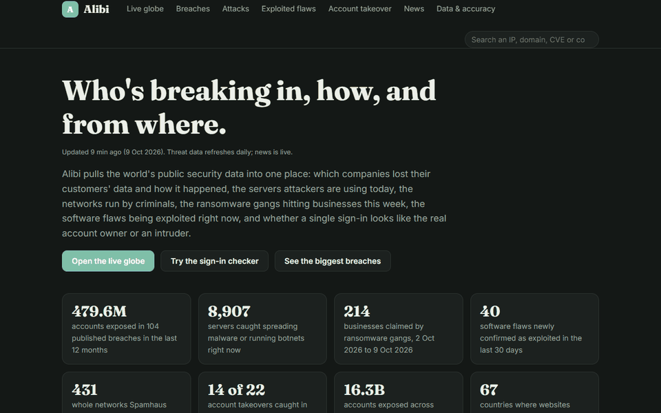
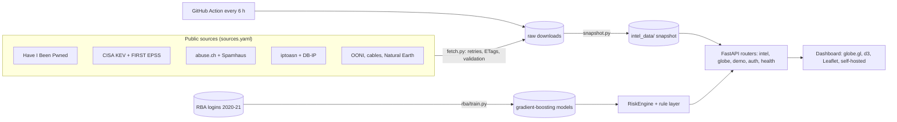

# Alibi: who's breaking in, how, and from where


Alibi is an open threat-intelligence dashboard built only on real public data. It covers:
- which companies lost their customers' data, and how it got out;
- the servers attackers are using right now, and the networks criminals run;
- the businesses ransomware gangs claimed this week;
- the software flaws being exploited today, and which to patch first.

All of it sits on a live 3D globe and refreshes from public sources on a schedule. On top of that, Alibi checks a
single sign-in and explains in plain words whether it looks like the account owner or an intruder.

**Live demo:** https://impossible-travel-auth-anomaly-engi.vercel.app · **API docs:** [/docs](https://impossible-travel-auth-anomaly-engi.vercel.app/docs)



## What it shows

<!-- numbers:start -->
Numbers from the snapshot of **9 October 2026** (the live app shows the current ones):

| Module | Today |
|---|---|
| Breaches | 1,024 breaches, 16.29 billion accounts; 104 breaches and 479.6 million accounts in the last 12 months |
| Attacks | 8,907 malware and botnet servers; 6,754 threat indicators in 48 hours; 431 criminal networks; 214 ransomware victims (2 October 2026 to 9 October 2026) |
| Exploited flaws | 1,739 flaws; 40 added in the last 30 days; 361 used by ransomware |
| Live globe | 4,596 states and provinces, 733 undersea cables, websites confirmed blocked in 67 countries |

**A finding worth knowing:** only 11% of the malware servers sit on hosting or VPN networks, about the same as those networks' 11% share of all addresses; 49% are home routers, cameras and other devices hijacked by botnets such as Mozi and Mirai. Blocking data centers alone misses most of them.
<!-- numbers:end -->

| Tab | What you can do |
|---|---|
| **Live globe** | Spin the real Earth (NASA imagery) with every country and 4,596 state borders. States are coloured by the metric you pick, for example malware servers per million IP addresses. Click any state for its numbers and the country's hotspot cities, or chain 2 or 3 countries into a sign-in journey. |
| **Breaches** | Every breach published by Have I Been Pwned, the biggest company breaches, and how each happened (read from HIBP's own write-up). |
| **Attacks** | Live malware and botnet servers, the networks hosting them, Spamhaus criminal networks, and this week's ransomware victims by industry, country and gang (totals only). |
| **Exploited flaws** | CISA's list of flaws exploited in real attacks, each with its FIRST EPSS exploit chance, and a "patch these first" list for the vendors you run. |
| **Account takeover** | Seven sign-in stories with real IPs from each country's networks: usual, Tor, new VPN, malware server, abroad, impossible travel, password guessing. Each story has its own link, e.g. `/#check/travel`. |
| **Search** | Any IP, domain, CVE or company: who owns it, whether it is reported for malware, and its breaches and flaws. IPs export as STIX 2.1. |
| **Data & accuracy** | When each feed was last downloaded, its licence, and the periods behind the login models. |

## How a sign-in is checked

Two layers decide the verdict.

**1. The models.** Two gradient-boosting models score 19 behaviour features per login: new country, network,
device or browser for this user; failed attempts; time since the last sign-in; and the IP's recent activity
across all users. Each score becomes a percentile of real validation logins: LOW below 90, MEDIUM 90 or more,
HIGH 99 or more, CRITICAL 99.9 or more.

**2. Live network and rule checks**, using today's public data:

| Signal | Source | Effect |
|---|---|---|
| IP reported for malware or botnet control | abuse.ch Feodo Tracker, ThreatFox, URLhaus | CRITICAL: block and alert the owner |
| IP in a network run by criminals | Spamhaus DROP / ASN-DROP | at least HIGH |
| Tor exit node | Tor Project exit list | at least HIGH |
| Hosting / VPN network the account has never used | iptoasn + 195 known hosting and VPN providers | at least HIGH (MEDIUM if it's their usual VPN) |
| 5+ wrong passwords in the last 10 attempts | login history | at least HIGH |
| Faster than 900 km/h between sign-ins (over 100 km) | coordinates | at least HIGH |

| Tier | What Alibi does |
|---|---|
| LOW | let them in |
| MEDIUM | let them in and log it for review |
| HIGH | ask for a one-time code |
| CRITICAL | block and alert the owner |


## Architecture



More in [docs/ARCHITECTURE.md](docs/ARCHITECTURE.md).

## Quick start

```bash
pip install -r requirements-dev.txt
make dev            # or: PYTHONPATH=src uvicorn ittravel.api.app:app --reload --port 8000
make test           # unit, API and parser tests
make snapshot       # download the feeds that are due and rebuild the snapshot (pip install ".[snapshot]")
```

The dashboard and `POST /v1/demo/check` need no key. `POST /v1/auth/evaluate` needs `ALIBI_API_KEY` set on the
server (see `.env.example`).

## Account-takeover model results

Trained and tested on the RBA login dataset: 31,269,264 logins from 4,304,857 users, February 2020 to February
2021. The test periods are months the model never saw. The models have not yet been tested on 2025 or 2026 logins
(see the roadmap).

### Account takeover: test period 2020-10-01 → 2020-11-30

5,403,650 logins, 22 of them confirmed account takeovers.

| Method | Takeovers caught | Logins challenged | ROC-AUC |
|---|---|---|---|
| **Model, 1% alert budget** | **14 of 22 (63.64%)** | 0.77% (76.5 per 10,000) | **0.978** |
| Model, 0.1% alert budget | 8 of 22 (36.36%) | 0.07% (6.8 per 10,000) | 0.978 |
| Rule: new country *or* new network for the user | 15 of 22 (68.18%) | 3.52% (351.6 per 10,000) | 0.823 |
| Rule: new device *and* new country | 4 of 22 (18.18%) | 0.05% (5.3 per 10,000) | 0.591 |
| Rule: country changed within 1 hour | 1 of 22 (4.55%) | 34.53% (3,452.7 per 10,000) | 0.350 |

**In business terms:** sending 0.77% of logins to a one-time code stops 14 of the 22 takeovers. The best simple
rule needs 4.6× as many challenges to catch one more. With only 22 takeovers in the window, the 95% confidence
interval for the 63.64% recall is 42.95% to 80.27%.

| Metric (1% budget) | Value |
|---|---|
| PR-AUC | 0.0038 (933× the 0.0004% base rate) |
| Precision | 0.03% (14 true alerts among 41,321) |
| Accuracy | 99.24% (meaningless here: flagging nothing would score 99.9996%) |
| Log loss / Brier | 0.00004 / 0.000004 |
| Confusion matrix | 5,362,321 TN · 41,307 FP · 8 FN · 14 TP |

### Attack-IP logins: test period 2021-01-01 → 2021-02-28

5,279,379 logins; 604,413 (11.45%) came from IPs on a known-attacker list.

| Method | ROC-AUC | PR-AUC | Precision | Recall | Logins flagged |
|---|---|---|---|---|---|
| **Model** | **0.7487** | **0.2358** | 28.76% | 3.84% | 1.53% |
| Rule: new country or new network | 0.4925 | n/a | 6.36% | 1.65% | 2.98% |
| Rule: country changed within 1 hour | 0.4902 | n/a | 10.88% | 33.48% | 35.22% |

The attack-IP model ranks better than chance but catches only 3.84% at that budget. That's why the live network
checks above sit on top of it.


**About the RBA data:** its authors synthesized each value from 33M+ real logins at a Norwegian single-sign-on
service, keeping the real per-user statistics. Its cities are random, so impossible travel isn't evaluated on it.
Training splits, features and policy: [docs/TRAINING_DATA_POLICY.md](docs/TRAINING_DATA_POLICY.md).

## Data sources and licences

<!-- sources:start -->
| Source | Licence / terms | Refreshed | Used for |
|---|---|---|---|
| Have I Been Pwned breach list | CC BY 4.0 (attribution and link required) | daily | Every published breach with its date, size, data types and write-up. |
| CISA Known Exploited Vulnerabilities catalog | US government public data | daily | Vulnerabilities confirmed as exploited in real attacks. |
| FIRST EPSS exploit prediction scores | free to use with attribution to FIRST (Exploit Prediction Scoring System) | daily | Daily probability that each CVE is exploited in the next 30 days. |
| iptoasn.com IP-to-ASN table | PDDL (public domain) | daily | Which network (ASN) and country announce every IPv4 range. |
| public-dns.info nameserver list | public list; only counts and city locations are published | daily | Working public DNS resolvers by country. |
| OONI web-connectivity aggregation, last 30 days | CC BY-NC-SA 4.0 | daily | Censorship tests, anomalies and confirmed blocks per country. |
| abuse.ch Feodo Tracker botnet C2 blocklist | CC0 | daily | Botnet command-and-control servers. |
| abuse.ch URLhaus recent malware URLs | CC0 | daily | Malware download URLs reported in the last 30 days. |
| abuse.ch ThreatFox recent indicators | CC0 | daily | Indicators of compromise shared in the last 48 hours. |
| Spamhaus DROP (IPv4) | free to use per the Spamhaus DROP terms | daily | Address blocks hijacked or run by criminals. |
| Spamhaus ASN-DROP | free to use per the Spamhaus DROP terms | daily | Whole networks (ASNs) run by criminals. |
| RansomLook ransomware leak-site posts, last 7 days | CC BY 4.0 (RansomLook); Alibi shows totals by day and gang only, never victim names or links | daily | Every post on ransomware gangs' leak sites in the last 7 days. |
| TeleGeography Submarine Cable Map, cables | CC BY-NC-SA 3.0 (as published by TeleGeography; not re-confirmed on their site in Oct 2026) | weekly | Undersea internet cable routes. |
| TeleGeography Submarine Cable Map, landing points | CC BY-NC-SA 3.0 (as above) | weekly | Where undersea cables come ashore. |
| DB-IP IP to City Lite | CC BY 4.0 ("IP Geolocation by DB-IP") | monthly | Approximate city of each IP range, used to pin servers to places. |
| Natural Earth admin-1 states and provinces (1:10m) | public domain | every 6 months | State and province borders (reference geography, changes rarely). |
| Tor Project Onionoo exit relays | Tor Metrics data, public | daily | Running Tor exit relays and their addresses. |
| Login Data Set for Risk-Based Authentication (Wiefling et al., 2022) | CC BY 4.0 | static (2020-02-03 to 2021-02-28) | trains and tests the login models |

Generated from [`sources.yaml`](sources.yaml) by `scripts/readme_numbers.py`.
<!-- sources:end -->

Also used: live RSS and YouTube feeds (headlines, titles and links only), NASA Blue Marble imagery and Natural
Earth country shapes (public domain), © OpenStreetMap contributors (ODbL) for street tiles. OONI and
TeleGeography data are non-commercial; Alibi is a non-commercial portfolio project.

## API

| Endpoint | Purpose |
|---|---|
| `GET /v1/intel/search?q=` | an IP, CVE, domain or company across everything |
| `GET /v1/intel/ip/{ip}` and `/stix` | who owns an IP and whether it's Tor, hosting / VPN, malware or criminal; STIX 2.1 bundle |
| `GET /v1/intel/breaches`, `/threats`, `/flaws`, `/flaws/priority` | snapshot summaries; flaws ranked for patching |
| `GET /v1/intel/globe/{metric}.jpg`, `/legend` | server-rendered globe textures and their colour classes |
| `GET /v1/intel/freshness`, `GET /v1/health` | each feed's last download, age, records and stale status |
| `POST /v1/demo/check` | score a whole sign-in story, no key (20 a minute per IP) |
| `POST /v1/auth/evaluate` | score one login and keep the user's history (needs `ALIBI_API_KEY`) |

Every `/v1` response carries an `X-Data-As-Of` header with the snapshot date.

## Limitations

- The login models are trained on 2020 to 2021 data whose values were synthesized from real logins. They are a
  baseline, not a production model.
- Only 22 takeovers sit in the test window, so the recall estimate is wide (43% to 80%).
- IP geolocation (DB-IP Lite) is roughly city-accurate; states with fewer than 100,000 addresses are not rated.
- Ransomware data has no published licence, so only totals are shown.
- Login history and rate limits live in memory per serverless instance.

## Roadmap

From the [master plan](docs/ARCHITECTURE.md), next:
1. A Cowrie honeypot on an isolated VM, to collect real 2025 to 2026 attack data.
2. A new attack-IP model trained on that data plus blocklist labels, with an out-of-time test, and the RBA model
   re-tested on it.
3. Baselines (rules, logistic regression) and ablations for every model.
4. Exports for MISP and OpenCTI, a TAXII feed and webhooks.

## Tests

`make test`: unit and API tests cover feature building (no look-ahead), the engine, IP lookups, every intel
endpoint, the globe textures and pick map, the fetcher (retries, 304s, truncated and invalid downloads), feed
validation with real saved fixtures, STIX output, search, health and rate limits. CI runs ruff and pytest on
Python 3.11 to 3.13.

## License

MIT for the code. Data stays under each source's licence, listed above.
