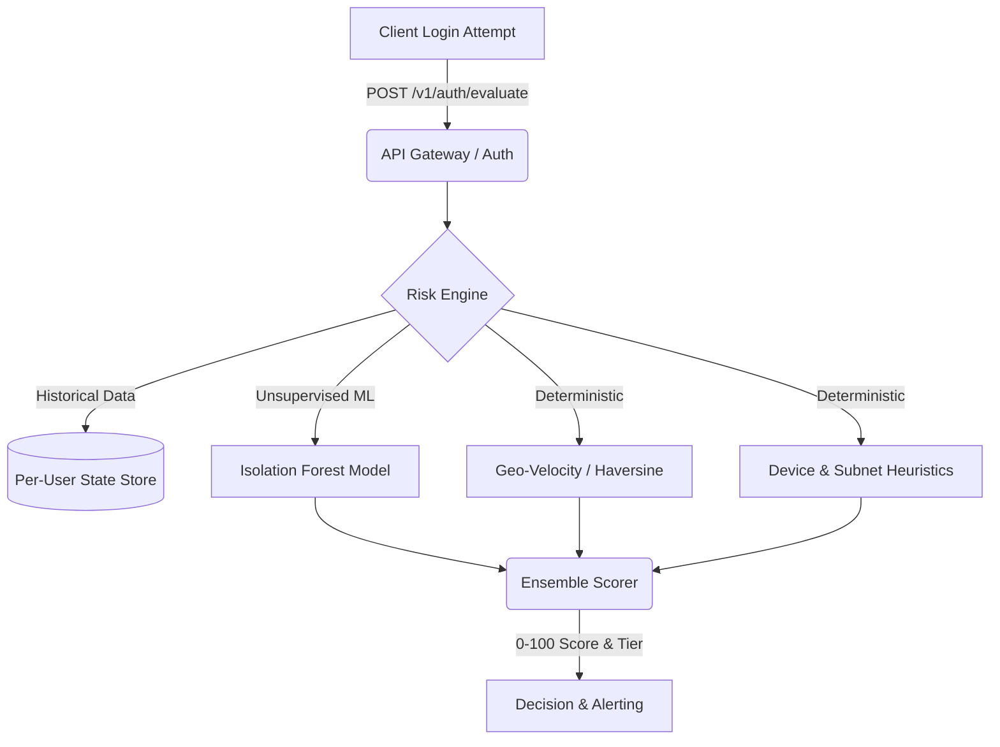

<h1 align="center">
  <br>
  🛡️ Impossible-Travel Auth Anomaly Engine (Enterprise Edition)
  <br>
</h1>

<h4 align="center">Next-Generation Account Takeover Prevention via Geotemporal Physics & Machine Learning</h4>

<p align="center">
  <a href="#features">Features</a> •
  <a href="#architecture">Architecture</a> •
  <a href="#deployment">Deployment</a> •
  <a href="#api-reference">API Reference</a> •
  <a href="#testing">Testing</a>
</p>

---

## 📖 Overview

The **Impossible-Travel Auth Anomaly Engine** is a high-performance, real-time login anomaly detection system. By fusing **IsolationForest** machine learning with deterministic geo-velocity physics (Haversine distance over time), it identifies compromised authentication attempts with extreme precision. 

If a user authenticates from New York and 10 minutes later from Tokyo, the implied travel speed is physically impossible. This engine flags that attack vector—alongside unrecognized devices and IP subnet jumps—returning a comprehensive 0–100 risk score.

Built for scale, security, and explainability.

## ✨ Enterprise Features

- **⚡ Real-Time Scoring**: Sub-millisecond inference for inline authentication blocking.
- **🧠 Hybrid Detection Model**: Combines Unsupervised ML (IsolationForest) with deterministic heuristics.
- **🌍 Geo-Velocity Physics**: Haversine calculations over time deltas to detect impossible physical travel.
- **📱 Device Fingerprint Entropy**: Identifies anomalous logins from unrecognized hardware.
- **🌐 Network Subnet Heuristics**: Detects sudden cross-continental IP subnet jumps.
- **📊 Explainable AI**: Outputs transparent reasoning (`reasons`) alongside the risk score.
- **🚀 Cloud-Native Ready**: Dockerized, Kubernetes-ready, and CI/CD integrated.

## 🏗️ Architecture



## 🚀 Deployment (CI/CD)

This engine is equipped with enterprise-grade deployment pipelines.

### Local Kubernetes / Docker
```bash
# Build the production image
docker build -t anomaly-engine:latest .

# Run the container
docker run -p 8000:8000 --env-file .env anomaly-engine:latest
```

## 📚 API Reference

### `POST /v1/auth/evaluate`

Evaluates a login event for risk.

**Headers:**
`X-API-Key: <your-secure-api-key>`

**Payload:**
```json
{
  "user_id": "usr_9000",
  "login_ts": "2026-08-02T15:30:00Z",
  "lat": 35.6762,
  "lon": 139.6503,
  "city": "Tokyo",
  "country": "JP",
  "device_id": "dev-macbook-pro",
  "ip": "203.0.113.15"
}
```

## 🧪 Testing & CI

We enforce strict quality gates. The project includes over 50 automated tests covering unit, integration, and CLI behavior.

```bash
# Run the full test suite
pytest tests/ -v --cov=src --cov-report=term-missing
```

---
<div align="center">
  <b>Built for secure, modern authentication flows.</b>
</div>
